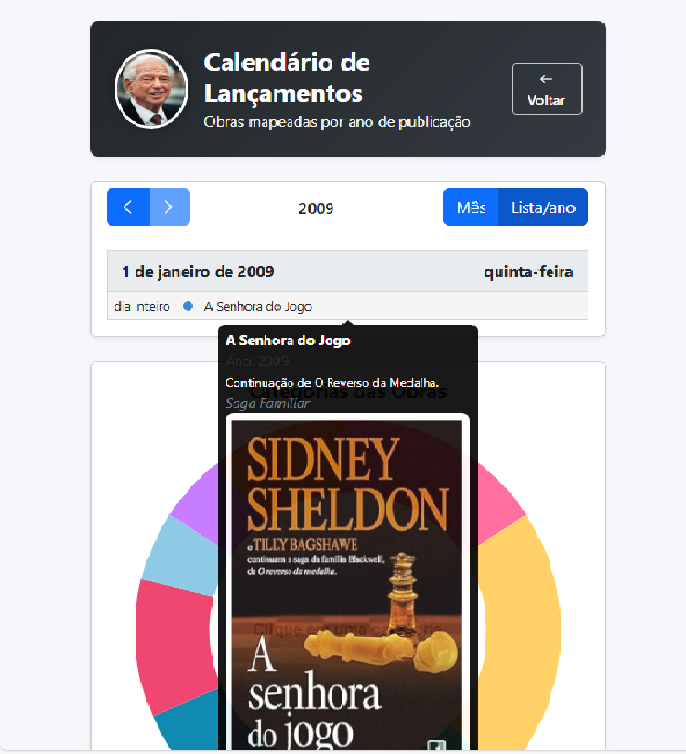
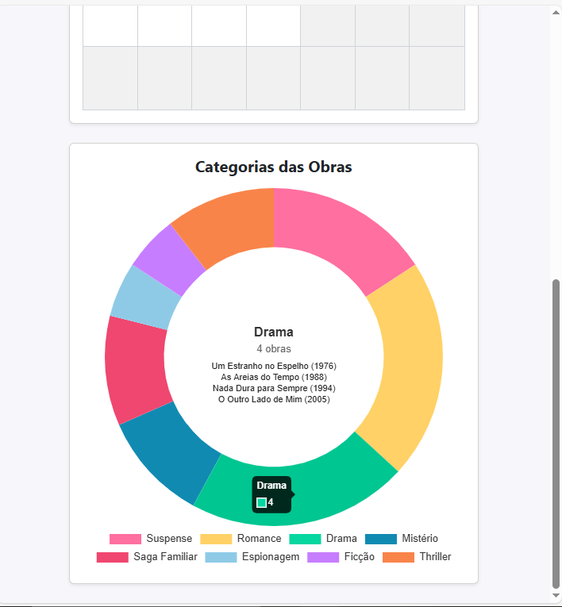

# Trabalho Prático 07 - Semanas 13 e 14

A partir dos dados cadastrados na etapa anterior, vamos trabalhar formas de apresentação que representem de forma clara e interativa as informações do seu projeto. Você poderá usar gráficos (barra, linha, pizza), mapas, calendários ou outras formas de visualização. Seu desafio é entregar uma página Web que organize, processe e exiba os dados de forma compreensível e esteticamente agradável.

Com base nos tipos de projetos escohidos, você deve propor **visualizações que estimulem a interpretação, agrupamento e exibição criativa dos dados**, trabalhando tanto a lógica quanto o design da aplicação.

Sugerimos o uso das seguintes ferramentas acessíveis: [FullCalendar](https://fullcalendar.io/), [Chart.js](https://www.chartjs.org/), [Mapbox](https://docs.mapbox.com/api/), para citar algumas.

## Informações do trabalho

- Nome: Ronaldo Coelho Junior
- Matricula: 898895
- Proposta de projeto escolhida: Pessoa - Autor e suas Obras
- Breve descrição sobre seu projeto: O projeto tem como objetivo apresentar dinamicamente as obras do autor Sidney Sheldon, utilizando dados vindos de um CRUD com JSON Server.

**Print da tela com a implementação**

<< Coloque aqui uma breve explicação da implementação feita nessa etapa>>

- Nesta etapa foi implementada a funcionalidade dinâmica utilizando as bibliotecas FullCalendar e Chart.js. O calendário exibe os lançamentos das obras a partir do CRUD (db.json) e o gráfico apresenta as categorias das obras de forma interativa.

<<  COLOQUE A IMAGEM TELA 1 AQUI >>

<<  COLOQUE A IMAGEM TELA 2 AQUI >>
